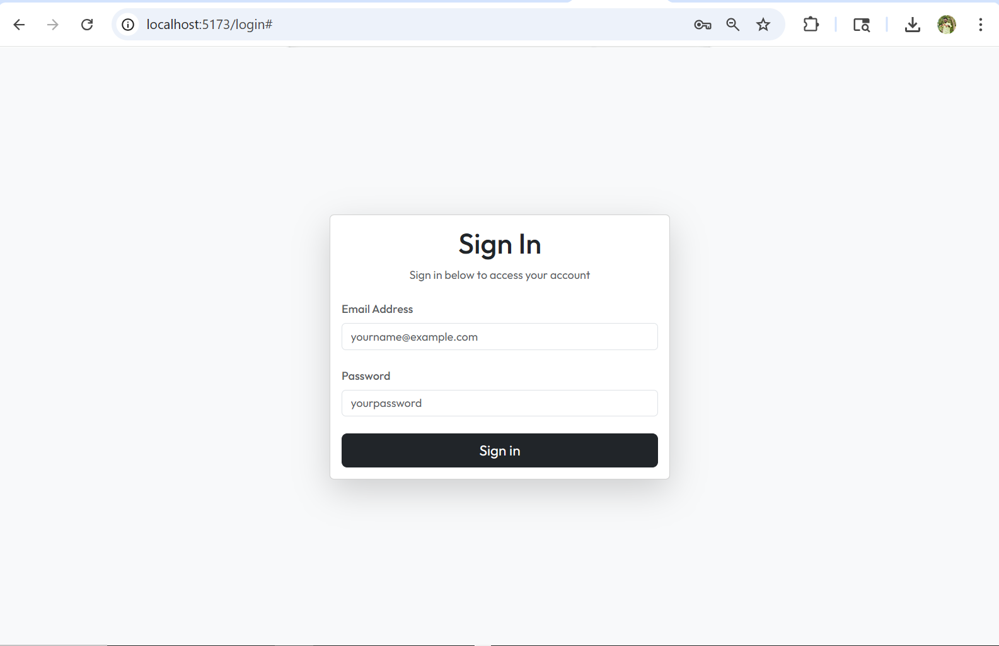
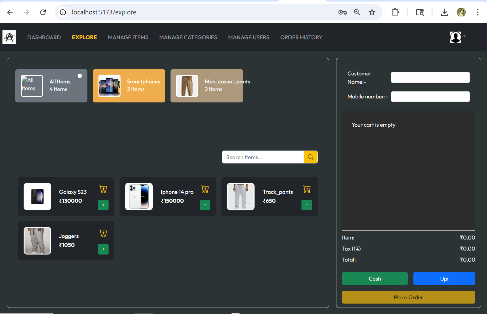
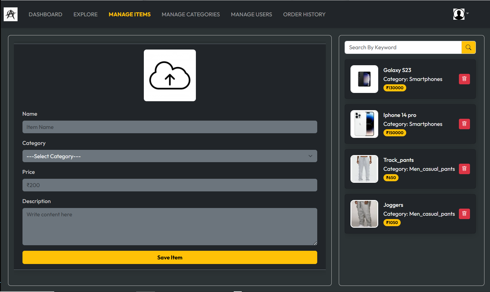
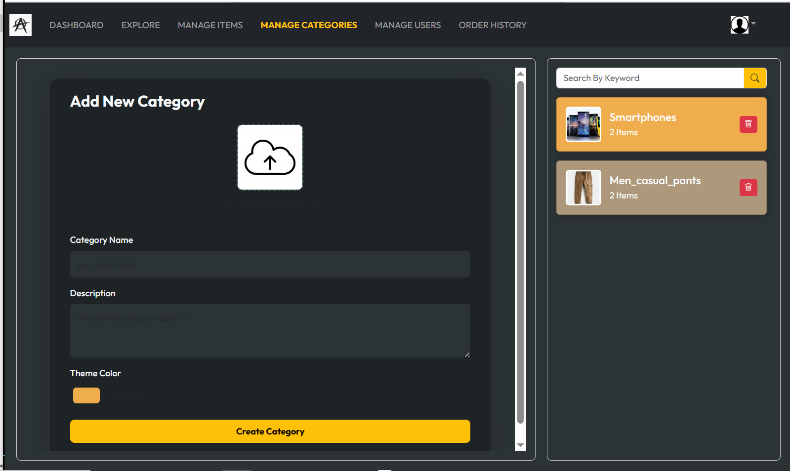
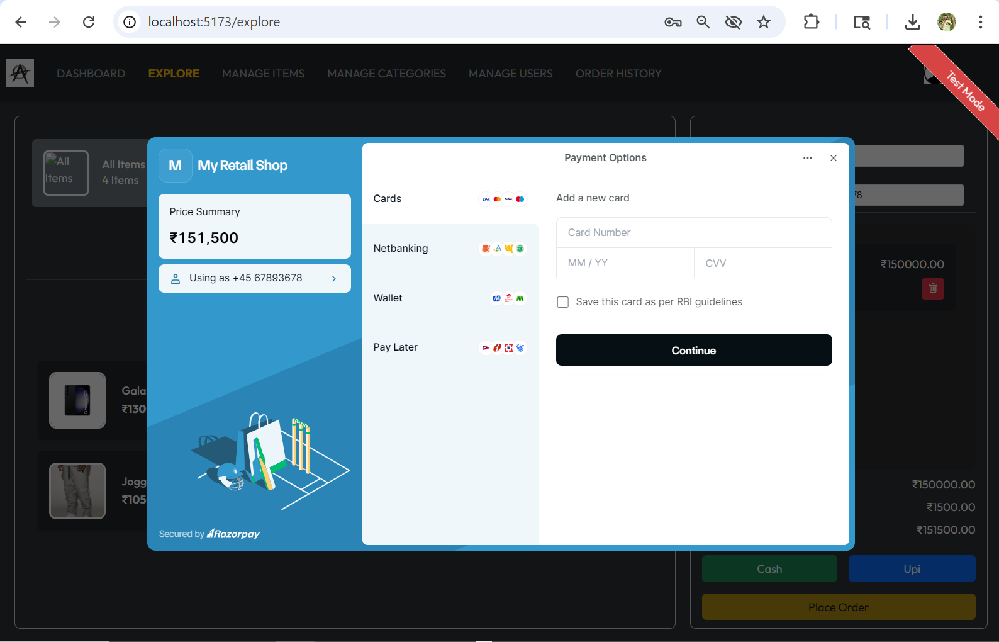

# 🧾 Retail Billing & Inventory Management System

A full-stack web application for managing retail billing, inventory, and user access — built with React.js and Spring Boot.

---

## 🚀 Live Demo

## 🚀 Live Backend
**[API Base URL](https://retail-billing-backend-pl6j.onrender.com/api/v1.0)**

---

## 🎥 Project Demo

*https://github.com/user-attachments/assets/780a151c-eef5-4d48-823f-f7d610852c70*

---

## 📸 Screenshots

### Login


### Explore

 
### Items


### Category


### Payment


---

## ⚙️ Tech Stack

| Layer | Technology |
|---|---|
| Frontend | React.js (Vite), HTML5, CSS3 |
| Backend | Java 17, Spring Boot |
| Database | MySQL |
| Auth & Security | JWT, Spring Security |
| Tools | Postman, Git, GitHub |

---

## ✨ Features

- Role-based access — Admin and Cashier views
- JWT authentication with secured endpoints
- Product and inventory management
- Invoice generation and billing
- File upload support

---

## 🏃 Run Locally

### Backend
```bash
# Update src/main/resources/application.properties with your MySQL credentials
./mvnw spring-boot:run
```
Runs at `http://localhost:8080`

### Frontend
```bash
cd client
npm install
npm run dev
```
Runs at `http://localhost:5173`

---

### 📡 Key API Endpoints


| Method | Endpoint | Description |
|---|---|---|
| POST | `/api/v1.0/encode` | User login — returns JWT token |
| GET | `/api/v1.0/items` | Get all products |
| POST | `/api/v1.0/admin/items` | Add a new product |
| GET | `/api/v1.0/categories` | Get all categories |
| POST | `/api/v1.0/admin/categories` | Add a new categories |
| GET | `/api/v1.0/dashboard` | Get Dashboard data |
| DELETE | `/api/v1.0/admin/items/{id}` | Delete a product |
| DELETE | `/api/v1.0/admin/categories/{cat_id}` | Delete a category |

---

## 👨‍💻 Author

**Sharath S**
- 📧 sharathsrao4529@gmail.com
- 💼 [LinkedIn](https://www.linkedin.com/in/hey-rao/)
- 🐙 [GitHub](https://github.com/9sharathsrao)
